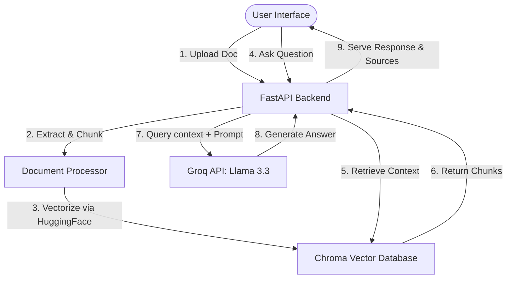

# RAG-Based Document Assistant

A high-performance, lightweight, and modern AI-powered document assistant. Users can upload text (`.txt`) and PDF (`.pdf`) documents, which are processed locally, embedded, and queried using Retrieval-Augmented Generation (RAG) powered by Groq's high-speed inference engine.

---

## Architecture Overview

The system is designed around a decoupled, fast, and local-first architecture combining Python/FastAPI with highly optimized open-source LLMs and vector models:



### Components

1. **Frontend (Minimalist Single Page App)**:
   - A distraction-free, light-mode design with clean borders, responsive typography, and sub-pixel lines.
   - Built with Vanilla HTML5, CSS3, and JavaScript, maintaining zero reliance on heavy external UI frameworks.
   - Real-time drag-and-drop or click-to-upload area with automated file validation.
   - Comprehensive Q&A prompt interface with clear source citations showing the exact chunk text and origin metadata.

2. **Backend (FastAPI)**:
   - Fast, asynchronous Python backend with robust CORS middleware.
   - Restful API routes for uploading documents, querying, listing documents, and clearing the vector database.
   - Built-in validation constraints for file formats and sizes.

3. **Document Processor**:
   - Automated text extraction pipeline for plain text files and PDF streams.
   - Chunking engine powered by LangChain's `RecursiveCharacterTextSplitter`.

4. **Vector Database & Local Embeddings**:
   - Local ChromaDB instance acting as the primary embedding store.
   - Embeddings are generated locally on the CPU utilizing a highly efficient, free embedding model: `sentence-transformers/all-MiniLM-L6-v2`. This completely eliminates costs and external networking overhead for vectorization.

5. **LLM Inference Engine**:
   - Integrated with Groq's low-latency API to query the state-of-the-art **`llama-3.3-70b-versatile`** model for high-fidelity responses.

---

## Setup Instructions

### Prerequisites
* **Python**: `3.9` up to `3.13`
* **Groq API Key**: A valid API key obtained from [Groq Console](https://console.groq.com/keys)

### Installation

1. **Clone the project workspace**:
   ```bash
   git clone <repository-url>
   cd RAG_Document_Assistant
   ```

2. **Set up the virtual environment**:
   ```bash
   # Create environment
   python3 -m venv venv
   
   # Activate environment
   source venv/bin/activate
   ```

3. **Install dependencies**:
   ```bash
   pip install -r requirements.txt
   ```

4. **Configure Environment Variables**:
   Create a `.env` file in the root directory:
   ```env
   # Groq API Key
   GROQ_API_KEY=gsk_your_actual_key_here

   # Chunking Parameters
   CHUNK_SIZE=1000
   CHUNK_OVERLAP=200
   MAX_FILE_SIZE_MB=10
   ```

5. **Run the Application**:
   Activate your virtual environment and start the FastAPI application:
   ```bash
   uvicorn main:app --reload
   ```

6. **Access the Application**:
   Open your browser and navigate to:
   👉 [http://localhost:8000](http://localhost:8000)

---

## Design Decisions

1. **Local Embeddings with HuggingFace**:
   We opted for `sentence-transformers/all-MiniLM-L6-v2` run locally. It is exceptionally fast, generates lightweight 384-dimensional vectors, and offers free embedding computation directly on CPU without needing paid OpenAI embedding calls.
   
2. **Groq Cloud Inference (`llama-3.3-70b-versatile`)**:
   We migrated from standard OpenAI GPT-3.5 APIs to the Groq Cloud API. It provides ultra-fast inference speed and extremely cost-effective LLM token generation under the advanced Llama 3.3 architecture.

3. **Fast-Fail Production Checks**:
   The backend implements a strict, non-silent environment validation on boot. If the `GROQ_API_KEY` is invalid or missing, it fails fast and halts boot to avoid silent degradation or mock demo modes in a production setting.

4. **ChromaDB Integration**:
   ChromaDB runs in-process locally. It is lightweight, requires no complex multi-container setup (like Dockerized Pgvector), and persists seamlessly to the local directory `chroma_db/`.

5. **Minimalist UI Philosophy**:
   The user interface is designed with a strict minimalist aesthetic. All decorative emojis, non-standard checkmarks, and heavy gradient backgrounds have been removed to ensure an elegant, uncluttered interface geared toward professional developer and production workspaces. Cache-busting features (`?v=1.1`) are embedded in resource URLs to prevent stale browser styling.

---

## Assumptions Made

1. **English Language**: The text extraction, document chunking parameters, and QA chain prompt assume the source documents are primary-language English.
2. **Text-Based PDFs**: The system assumes PDF uploads are searchable text-based PDFs (and not scanned image documents).
3. **Single-Tenant Use**: The application is configured for single-tenant use with a shared local database (`chroma_db/`). No multi-user authentication, authorization, or document isolation namespaces are implemented.
4. **Document Retention**: Once files are indexed, they persist locally inside `/chroma_db` across server restarts until the database is explicitly wiped via the `/api/clear` endpoint.
5. **Local Environment Constraints**: CPU processing is assumed to be the default standard for computing local text embeddings (using PyTorch CPU runtime under sentence-transformers).
