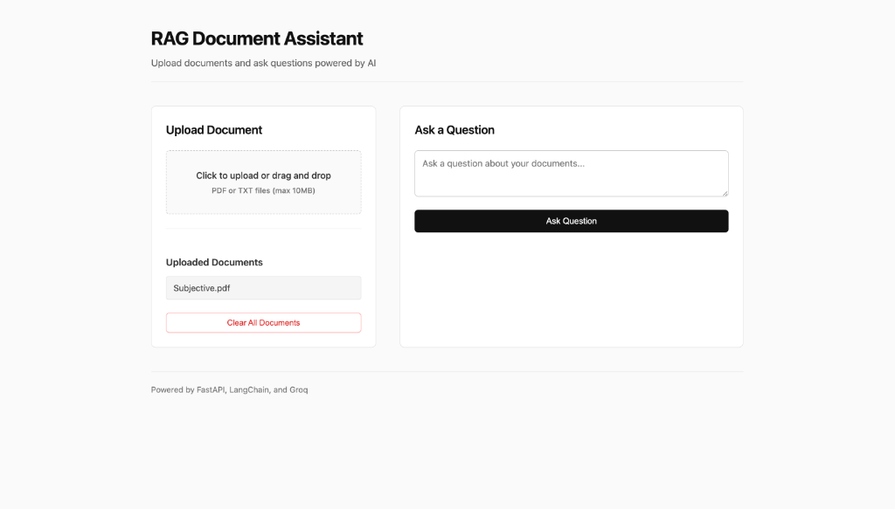
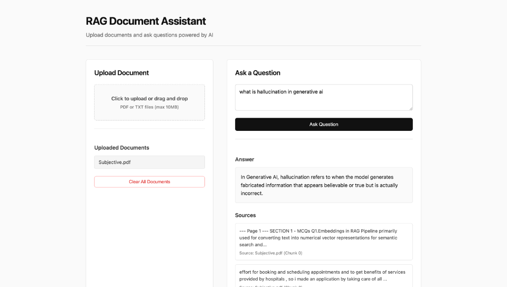

# RAG Document Assistant - Interface Walkthrough

Below are the screenshots showcasing the interface of the minimalist **RAG Document Assistant** in various operational states.

---

### 1. Welcome & Empty State
When the application first loads, it displays a clean, distraction-free landing state.
* **Upload Section**: Standard area supporting drag-and-drop or click-to-upload for PDF/TXT files.
* **Document Status**: Displays "No documents uploaded yet" in a muted gray block.
* **Query Panel**: Prompts the user to enter their question, with the submit button locked to a prominent minimalist black focus state.

---

### 2. Document Uploaded State
After successfully dragging or selecting a file, the document is vectorized on your local CPU via the `all-MiniLM-L6-v2` embedding model and stored in ChromaDB.
* **Instant Listing**: The document filename (`Subjective.pdf`) is displayed immediately in the uploaded documents panel.
* **Management Controls**: A clear "Clear All Documents" action button is provided at the bottom of the column to reset the database.

---

### 3. Ask Question & Citing Sources
When a question is asked (e.g., *"what is hallucination in generative ai"*), the system queries ChromaDB for relevant text chunks and forwards them to Groq's high-speed `llama-3.3-70b-versatile` LLM.
* **Answer Output**: Renders the generated response inside a clean, bordered container.
* **Verified Sources**: Lists the exact text segments utilized from the uploaded document, along with their metadata (origin file, chunk number) to prevent hallucinations and establish transparency.

